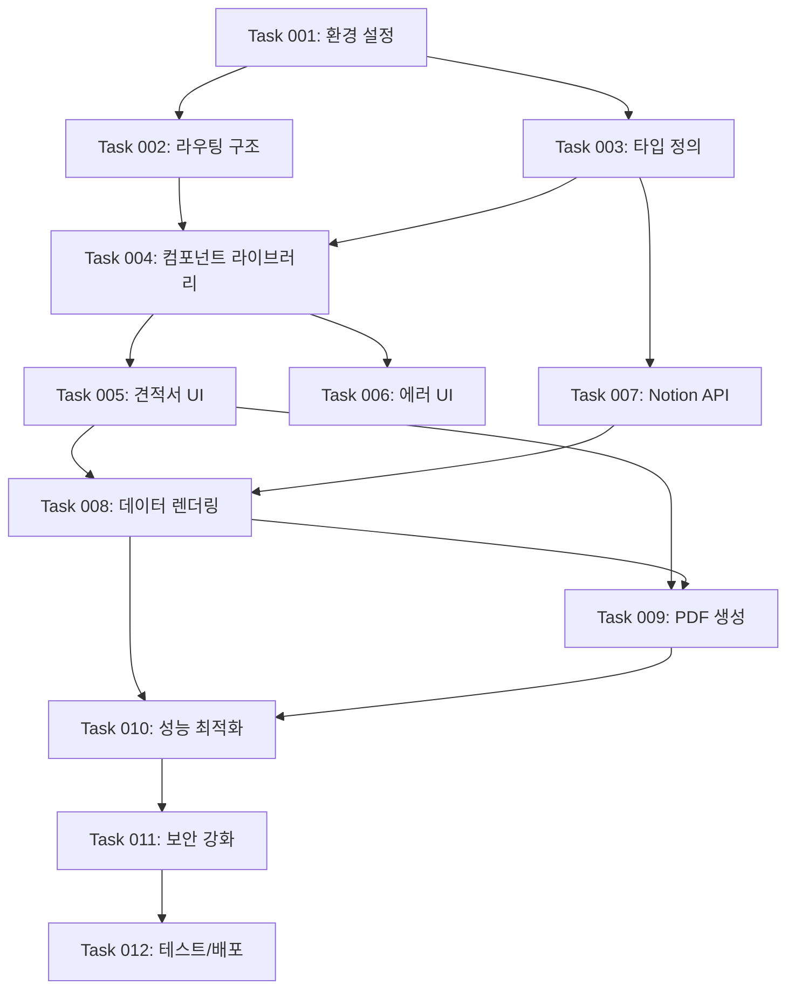

# 노션 기반 견적서 관리 시스템 MVP 개발 로드맵

노션을 데이터베이스로 활용하여 견적서를 관리하고, 클라이언트가 웹에서 조회 및 PDF 다운로드할 수 있는 시스템

## 개요

노션 기반 견적서 관리 시스템 MVP는 프리랜서와 소규모 기업을 위한 간단하고 효율적인 견적서 관리 솔루션으로 다음 기능을 제공합니다:

- **노션 데이터베이스 연동**: Notion API를 통한 실시간 견적서 데이터 조회
- **견적서 웹 조회**: 고유 URL을 통한 견적서 내용 확인
- **PDF 다운로드**: 견적서를 PDF 파일로 변환하여 저장 및 인쇄

## 개발 워크플로우

1. **작업 계획**
   - 기존 코드베이스를 학습하고 현재 상태를 파악
   - 새로운 작업을 포함하도록 `ROADMAP.md` 업데이트
   - 우선순위 작업은 마지막 완료된 작업 다음에 삽입

2. **작업 생성**
   - 기존 코드베이스를 학습하고 현재 상태를 파악
   - `/tasks` 디렉토리에 새 작업 파일 생성
   - 명명 형식: `XXX-description.md` (예: `001-setup.md`)
   - 고수준 명세서, 관련 파일, 수락 기준, 구현 단계 포함
   - 예시를 위해 `/tasks` 디렉토리의 마지막 완료된 작업 참조
   - API/비즈니스 로직 작업 시 "## 테스트 체크리스트" 섹션 필수 포함 (Playwright MCP 테스트 시나리오 작성)

3. **작업 구현**
   - 작업 파일의 명세서를 따름
   - 기능과 기능성 구현
   - API 연동 및 비즈니스 로직 구현 시 Playwright MCP 테스트 필수
   - 구현 완료 후 Playwright MCP를 사용한 E2E 테스트 실행
   - 테스트 통과 확인 후 다음 단계로 진행
   - 각 단계 후 작업 파일 내 단계 진행 상황 업데이트
   - 각 단계 완료 후 중단하고 추가 지시를 기다림

4. **로드맵 업데이트**
   - 로드맵에서 완료된 작업을 ✅로 표시

## 개발 단계

### Phase 1: 애플리케이션 골격 구축 ✅

- **Task 001: 프로젝트 초기 설정 및 환경 구성** ✅ - 완료
  - ✅ Next.js 15.5.3 프로젝트 기본 구조 검증
  - ✅ 환경 변수 설정 (.env.local에 실제 NOTION_API_KEY / NOTION_DATABASE_ID 값 입력 완료)
  - ✅ TypeScript 및 ESLint 설정 확인
  - ✅ Notion API 연동을 위한 환경 구성 (@notionhq/client 설치, lib/env.ts에 검증 규칙 추가, .env.example 작성)

- **Task 002: 라우팅 구조 및 페이지 골격 생성** ✅ - 완료
  - ✅ `/app/invoice/[notionPageId]/page.tsx` 생성
  - ✅ `/app/invoice/[notionPageId]/loading.tsx` 생성
  - ✅ `/app/invoice/[notionPageId]/error.tsx` 생성
  - ✅ 커스텀 404 페이지 (`/app/not-found.tsx`)
  - ✅ 공통 레이아웃 설정

- **Task 003: 타입 정의 및 데이터 모델 설계** ✅ - 완료
  - ✅ 견적서 데이터 타입 인터페이스 정의 (src/types/invoice.ts)
  - ✅ Notion API 응답 타입 정의 (src/types/notion.ts)
  - ✅ PDF 생성 관련 타입 정의 (src/types/pdf.ts)
  - 에러 핸들링 타입 정의 (error.tsx에서 기본 Error 타입 사용 중, 별도 타입은 Task 007/008 시 필요 시 추가)

### Phase 2: UI/UX 완성 (더미 데이터 활용) ✅

- **Task 004: 공통 컴포넌트 라이브러리 구축** ✅ - 완료
  - ✅ shadcn/ui 설치 및 설정 (new-york 스타일)
  - ✅ 기본 UI 컴포넌트 추가 (Button, Card, Dialog, Form 등)
  - ✅ 더미 견적서 데이터 생성 유틸리티 (`src/lib/mock/invoice.mock.ts`, shadcn table 컴포넌트 포함)
  - ✅ 디자인 시스템 토큰 설정 (색상, 타이포그래피) — 기존 시맨틱 토큰으로 충분함을 검토 확인, 변경 없음

- **Task 005: 견적서 조회 페이지 UI 구현** ✅ - 완료
  - ✅ 견적서 헤더 컴포넌트 (회사 정보, 견적서 번호)
  - ✅ 클라이언트 정보 섹션
  - ✅ 견적 항목 테이블 컴포넌트
  - ✅ 총액 요약 섹션
  - ✅ PDF 다운로드 버튼 UI
  - ✅ 반응형 레이아웃 구현 (모바일/태블릿/데스크톱)

- **Task 006: 에러 및 로딩 상태 UI 구현** ✅ - 완료
  - ✅ 404 에러 페이지 디자인 완성
  - ✅ 로딩 스켈레톤 컴포넌트 (invoice 전용, `invoice-skeleton.tsx`)
  - ✅ 에러 메시지 컴포넌트
  - ✅ 빈 상태(Empty state) 컴포넌트

### Phase 3: 핵심 기능 구현 ✅

- **Task 007: Notion API 통합 구현** ✅ - 완료
  - ✅ `/lib/notion.ts` - Notion 클라이언트 초기화
  - ✅ `/lib/services/invoice.service.ts` - 견적서 데이터 서비스 (`getInvoiceById`, `NotionInvoiceNotFoundError`)
  - ✅ `/lib/utils/notion-parser.ts` - Notion 데이터 파싱 유틸리티 (실제 한글 스키마 기반 `parseInvoicePage`)
  - ✅ API 에러 핸들링 (object_not_found/archived/partial → 커스텀 에러로 통일, 그 외 rethrow)
  - ✅ 데이터 변환 및 검증 로직 (상태 라벨 역매핑, 금액은 수량×단가 계산값 사용)
  - ✅ Playwright MCP를 활용한 API 엔드포인트 통합 테스트 (Task 009-1에서 실 데이터로 검증 완료)

- **Task 008: 견적서 데이터 페칭 및 렌더링** ✅ - 완료
  - ✅ Server Component에서 Notion 데이터 페칭
  - ✅ 더미 데이터를 실제 API 데이터로 교체
  - ✅ 동적 라우팅 파라미터 처리
  - ✅ 데이터 유효성 검증 (F011, `NotionInvoiceNotFoundError` → `notFound()`)
  - ✅ 실시간 데이터 동기화 (Notion API 실시간 조회)
  - ✅ Playwright MCP로 데이터 렌더링 E2E 테스트

- **Task 009: PDF 생성 및 다운로드 기능** ✅ - 완료
  - ✅ @react-pdf/renderer 설치 및 설정
  - ✅ PDF 템플릿 컴포넌트 개발 (`src/components/pdf/invoice-template.tsx`)
  - ✅ API Route 구현 (`/api/generate-pdf`)
  - ✅ PDF 다운로드 트리거 로직 (fetch → blob → 다운로드)
  - ✅ 한글 폰트 지원 설정 (OFL 라이선스 NanumGothic 임베딩)
  - ✅ Playwright MCP로 PDF 생성 플로우 테스트

- **Task 009-1: 핵심 기능 통합 테스트** ✅ - 완료
  - ✅ Playwright MCP를 사용한 전체 사용자 플로우 테스트 (실 Notion 데이터 기준)
  - ✅ API 연동 및 비즈니스 로직 검증
  - ✅ 에러 핸들링 및 엣지 케이스 테스트 (404, 빈 항목, 8개 이상 항목, 반응형 360/768/1280px)
  - ✅ 데이터 무결성 및 일관성 검증
  - ✅ 성능 및 응답 시간 테스트 (페이지 로드/PDF 생성 모두 목표치 이내)

### Phase 4: 고급 기능 및 최적화

- **Task 010: 성능 최적화 및 캐싱**
  - Next.js 캐싱 전략 구현
  - 이미지 최적화 설정
  - 폰트 최적화 (subset 생성)
  - Notion API 호출 최적화
  - React Suspense 경계 설정

- **Task 011: 보안 및 에러 처리 강화**
  - API 키 보안 검증
  - Rate limiting 구현
  - 상세 에러 로깅 시스템
  - 404/500 에러 처리 개선
  - CORS 정책 설정

- **Task 012: 테스트 및 배포 준비**
  - 단위 테스트 작성 (컴포넌트, 유틸리티)
  - 통합 테스트 작성 (API, 페이지)
  - E2E 테스트 시나리오 구현 (Playwright MCP 사용)
  - Vercel 배포 설정
  - 환경별 설정 관리 (dev/staging/prod)

## 작업별 상세 구현 사항

### Task 001: 프로젝트 초기 설정 및 환경 구성

**예상 소요 시간**: 2-3시간

**구현 내용**:

- `.env.local` 파일 생성 및 환경 변수 설정
  ```env
  NOTION_API_KEY=secret_xxxxxxxxxxxxx
  NOTION_DATABASE_ID=xxxxxxxxxxxxx
  ```
- `package.json` 의존성 확인 및 업데이트 (`@notionhq/client` 추가)
- TypeScript 설정 검증 (`tsconfig.json`)
- ESLint/Prettier 설정 확인
- Git hooks 설정 (husky, lint-staged)

**완료 기준**:

- [x] 환경 변수가 올바르게 설정됨 (Notion API 키 및 데이터베이스 ID 포함, `.env.local`에 실제 값 입력 완료)
- [x] 모든 의존성이 설치되고 버전이 일치함 (@notionhq/client 추가)
- [x] 개발 서버가 정상 실행됨 (`npm run dev`)
- [x] 린트 및 타입 체크 통과
- [x] Git hooks (husky, lint-staged) 설정 완료

### Task 002: 라우팅 구조 및 페이지 골격 생성

**예상 소요 시간**: 3-4시간

**구현 내용**:

- `/app/invoice/[notionPageId]/page.tsx` 생성
- `/app/invoice/[notionPageId]/loading.tsx` 생성
- `/app/invoice/[notionPageId]/error.tsx` 생성
- `/app/not-found.tsx` 커스텀 404 페이지
- 공통 레이아웃 설정 (`/app/invoice/layout.tsx`)

**완료 기준**:

- [x] 동적 라우팅이 정상 작동함 (/invoice/[notionPageId] 구조 구현)
- [x] 각 페이지 파일이 생성되고 기본 구조를 가짐 (page, loading, error 컴포넌트)
- [x] 404 페이지가 올바르게 표시됨 (커스텀 not-found.tsx 구현)
- [x] 메타데이터가 올바르게 설정됨 (generateMetadata 함수 구현)

### Task 003: 타입 정의 및 데이터 모델 설계

**예상 소요 시간**: 2-3시간

**구현 내용**:

- `/types/invoice.ts` - 견적서 관련 타입
- `/types/notion.ts` - Notion API 응답 타입
- `/types/pdf.ts` - PDF 생성 관련 타입
- `/lib/constants.ts` - 상수 정의
- 타입 안전성을 위한 유틸리티 타입 생성

**완료 기준**:

- [x] 핵심 데이터 모델이 타입으로 정의됨 (Invoice, InvoiceItem) — CompanyInfo 등 추가 모델은 PRD에 명시되면 추후 보강
- [x] Notion API 응답 타입이 정의됨 (NotionInvoicePage, NotionPropertyValue)
- [x] TypeScript 컴파일 에러가 없음
- [x] 타입 자동완성이 정상 작동함
- [ ] 엄격한 타입 체크 (strict mode) 활성화됨

### Task 007: Notion API 통합 구현

**예상 소요 시간**: 4-5시간

**구현 내용**:

- `/lib/notion.ts` - Notion 클라이언트 초기화
- `/lib/services/invoice.service.ts` - 견적서 데이터 서비스
- `/lib/utils/notion-parser.ts` - Notion 데이터 파싱 유틸리티
- API 에러 핸들링 및 재시도 로직
- 데이터 변환 및 검증 로직

**사전조건**: `docs/guides/notion-setup.md` 참조 (Notion 자격증명 설정 및 데이터베이스 구성 체크리스트)

**완료 기준**:

- [x] Notion API 연결이 성공함
- [x] 견적서 데이터를 정상적으로 조회함
- [x] 데이터가 올바른 형식으로 변환됨
- [x] 에러 처리가 적절히 구현됨

### Task 009: PDF 생성 및 다운로드 기능

**예상 소요 시간**: 5-6시간

**구현 내용**:

- `/components/pdf/invoice-template.tsx` - PDF 템플릿
- `/app/api/generate-pdf/route.ts` - PDF 생성 API
- `/lib/pdf/generator.ts` - PDF 생성 로직
- 한글 폰트 설정 및 스타일링
- 다운로드 트리거 및 파일명 설정

**완료 기준**:

- [x] PDF가 정상적으로 생성됨
- [x] 한글이 올바르게 표시됨
- [x] 레이아웃이 견적서 형식에 맞음
- [x] 다운로드가 모든 브라우저에서 작동함 (Playwright Chromium 기준 검증, 타 브라우저는 표준 fetch/blob API 사용으로 호환 예상)

## 기술적 의존성 관계



## MVP 체크리스트

### 핵심 기능 구현 확인

- [x] **F001**: Notion API를 통한 견적서 데이터 조회
- [x] **F002**: 고유 URL로 특정 견적서 내용 표시
- [x] **F003**: 견적서를 PDF 파일로 변환 및 다운로드

### 필수 지원 기능 구현 확인

- [x] **F010**: 노션 데이터베이스 ID 기반 고유 URL 생성
- [x] **F011**: 존재하지 않는 견적서 접근 시 에러 처리
- [x] **F012**: 반응형 레이아웃 (모바일/태블릿/데스크톱)

### 품질 검증

- [x] 모든 페이지가 정상적으로 로드됨
- [x] Notion 데이터가 실시간으로 동기화됨
- [x] PDF 다운로드가 모든 환경에서 작동함
- [x] 에러 처리가 사용자 친화적임
- [x] 반응형 디자인이 모든 기기에서 작동함

### 테스트 검증

- [x] API 연동 및 비즈니스 로직에 Playwright MCP 테스트 수행되었는가?
- [x] 모든 사용자 플로우가 E2E 테스트되었는가?
- [x] 에러 핸들링 및 엣지 케이스가 테스트되었는가?

## 예상 개발 일정

**총 예상 기간**: 2-3주 (1인 개발 기준)

- **Week 1**: Phase 1 + Phase 2 (Task 001-006)
  - 프로젝트 설정 완료 (Task 001-003)
  - UI 구현 완료 (Task 004-006)
  - 더미 데이터로 전체 플로우 검증

- **Week 2**: Phase 3 (Task 007-009)
  - Notion API 통합 (Task 007)
  - 실제 데이터 연동 (Task 008)
  - PDF 생성 기능 구현 (Task 009)
  - 통합 테스트 및 검증 (Task 009-1)

- **Week 3**: Phase 4 (Task 010-012)
  - 성능 최적화
  - 테스트 및 버그 수정
  - 배포 준비 및 실제 배포

## 위험 요소 및 대응 방안

### 기술적 위험

1. **Notion API 제한**
   - Rate limit 초과 가능성
   - 대응: 캐싱 전략 구현, 요청 최적화

2. **PDF 한글 렌더링 문제**
   - 폰트 임베딩 이슈
   - 대응: 사전 테스트, 대체 라이브러리 준비

3. **대용량 견적서 처리**
   - 많은 항목 시 성능 저하
   - 대응: 페이지네이션, 가상 스크롤링

### 비즈니스 위험

1. **사용자 경험 저하**
   - 느린 로딩 속도
   - 대응: 스켈레톤 UI, 점진적 로딩

2. **보안 이슈**
   - API 키 노출
   - 대응: 서버 사이드 처리, 환경 변수 관리

## 성공 지표

- **기술적 지표**
  - 페이지 로드 시간 < 3초
  - PDF 생성 시간 < 5초
  - 에러율 < 1%

- **사용자 경험 지표**
  - 모바일 반응형 100% 지원
  - 크로스 브라우저 호환성 100%
  - 견적서 조회 성공률 > 99%

---

**📝 문서 버전**: v2.8
**📅 작성일**: 2025-10-05
**📅 최종 업데이트**: 2026-07-05
**🎯 목표**: MVP 핵심 기능 구현을 통한 빠른 시장 검증
**📊 진행 상황**: 9/12 Tasks 완료 (75%) — Phase 1(애플리케이션 골격 구축) 완료 ✅ (Task 001~003). Phase 2(UI/UX 완성) 완료 ✅ (Task 004~006). Phase 3(핵심 기능 구현) 완료 ✅ (Task 007 Notion API 연동, Task 008 실데이터 페칭/렌더링, Task 009 PDF 생성/다운로드, Task 009-1 Playwright MCP 통합 테스트) — 실 Notion 데이터로 라이브 검증 완료, MVP 핵심 기능(F001~F003, F010~F012) 전부 충족. Phase 4(Task 010~012, 성능 최적화·보안 강화·테스트/배포)는 아직 미착수.
